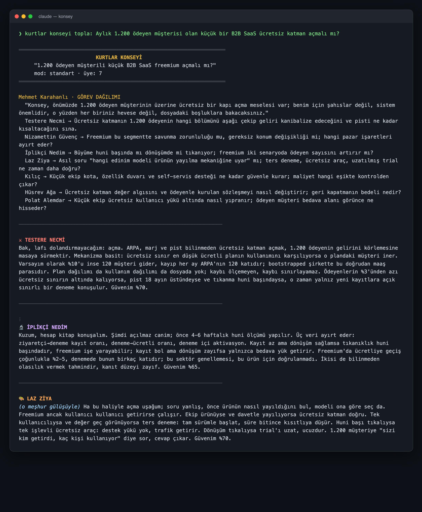
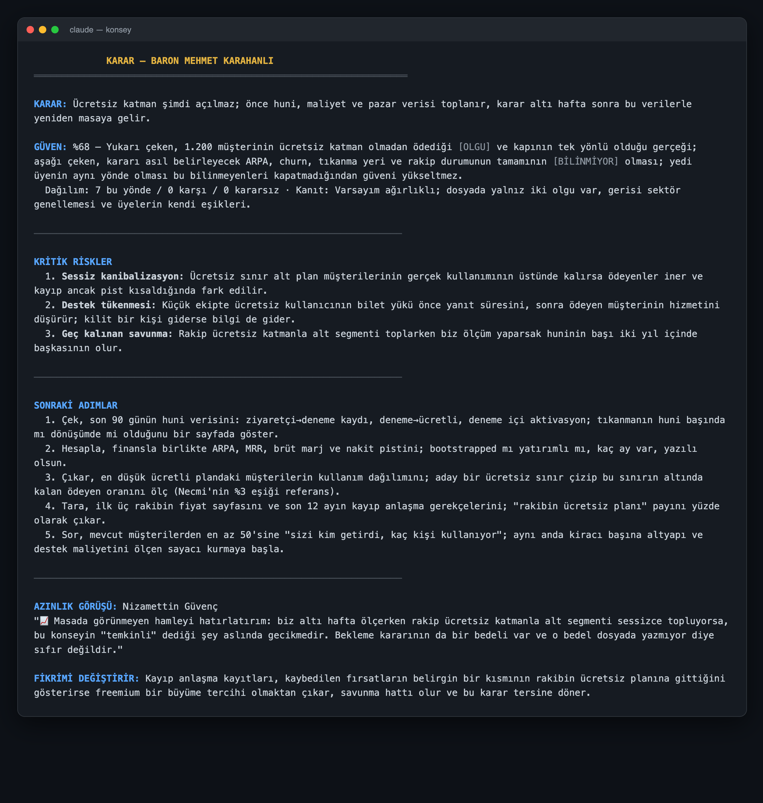
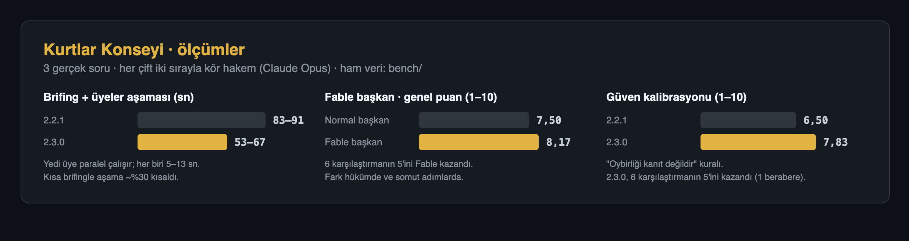

# Kurtlar Konseyi · Konsey

[](https://github.com/cemal-demirci/claude-konsey/releases)
[](LICENSE)
[](https://github.com/cemal-demirci/claude-konsey/actions)


**Zor kararınızı tek bir yapay zekâya değil, Kurtlar Konseyi'ne sorun.**

Testere Necmi planın en tehlikeli kusurunu yüzünüze vurur. İplikçi Nedim "Kuzum, hesap kitap konuşalım" diyerek rakamlara
girer. Laz Ziya *(o meşhur gülüşüyle)* kimsenin bakmadığı arka kapıyı gösterir. Hüsrev Ağa on yıl sonrasını sorar.
Masanın başında da Baron Mehmet Karahanlı oturur: görevleri o dağıtır, hükmü o verir.

Kostüm eğlencelidir ama arkasındaki iş ciddidir. Yedi uzman (eleştirmen, stratejist, analist, vizyoner, mühendis,
filozof, hümanist) **birbirinin cevabını görmeden, aynı anda** kendi görüşünü yazar. Başkan **Fable** modelinde
çalışır ve oy saymaz; gerekçeleri tartıp **taraf tutan** bir hüküm verir:

- tek cümlelik **karar**
- nereden geldiği açıklanan bir **güven yüzdesi**
- **3 kritik risk** ve yarın başlanabilecek **5 somut adım**
- bir **azınlık görüşü** ve kararı tersine çevirecek **tek olgu**

Claude Code eklentisidir. Her şey Claude'un içinde çalışır: dış model ya da API anahtarı yoktur. İki satırda
kurulur, Türkçe ve İngilizce konuşur, GPL-3.0 lisanslıdır. Karakter istemeyenler için `klasik` tema da vardır
(`--tema klasik`).

<p align="center"></p>

<p align="center"></p>

Görüntüler gerçek bir toplantının çıktısıdır; metne dokunulmadı, yalnızca kısaltıldı (`⋮`) ve terminal görünümünde
render edildi ([`scripts/ekran.py`](scripts/ekran.py)). Toplantının tamamı:
[`bench/sonuclar/2.3.0-soru2.md`](bench/sonuclar/2.3.0-soru2.md). Diğer örnekler: [`examples/`](examples/).

> 🥚 Konseyin kapısını bazen biri daha çalar. Kim olduğunu dizi izleyenler bilir; adıyla çağırın.
> Geldiğinde kararın karşısına çıkacak en "erkek" düşmanı kurar ve Karahanlı'yı ona cevap vermeye zorlar.

---

## Kurtlar Konseyi

Varsayılan tema `kurtlar`: yedi uzmanlığı Kurtlar Vadisi'nin Konsey karakterlerine giydirir. Uzmanlık, kanıt ve
dürüstlük kuralları klasik temayla **birebir aynıdır**; değişen, sesin ve bakışın rengidir. Karakterler orijinallerine
bağlı konuşur, ama abartıya kaçmaz: her üye bir konuşmada imza sözlerinden en fazla birini kullanır ve şive birkaç
kelimeyle hissettirilir. Karakterin adı silindiğinde de geriye işe yarar bir görüş kalmalıdır.

| Karakter | Klasikteki rolü | Neye bakar | Nasıl konuşur |
|---|---|---|---|
| ⚔ **Testere Necmi** | Eleştirmen | Planın en tehlikeli kusuru, yanlış varsayım, geri dönüşü olmayan adım | Sert, dobra, kısa cümleler: "Bak, lafı dolandırmayacağım…" |
| 📈 **Nizamettin Güvenç** | Stratejist | Pazar, rakip, zamanlama, birim ekonomisi | Soğukkanlı ve kurnaz; masada görünmeyen hamleyi, iki hamle sonrasını söyler |
| 🔬 **İplikçi Nedim** | Analist | Olgu sanılan varsayımlar, taban oranlar, kâr-zarar | Tüccar ağzıyla: "Kuzum, hesap kitap konuşalım", "Vallahi, Allah seni inandırsın, bu rakam tutmaz canim" |
| 🎨 **Laz Ziya** | Vizyoner | Yanlış sorulmuş soru, yapay kısıtlar, arka kapılar | Karadeniz ağzı; gülüşü harfle yazılmaz, sahne notu olur: *(o meşhur gülüşüyle)* "Uşağum, ha bu işin bir de arka kapısı var da…" |
| ⚙ **Kılıç** | Mühendis | Uygulanabilirlik, ölçekte kırılma, gizli bağımlılık | Sahanın adamı, az konuşur: "Sahada iş başka yürür" |
| 🧘 **Hüsrev Ağa** | Filozof | Neyi optimize ettiğimiz, bedeli kimin ödediği, on yıl sonrası | Yaşlı bilge, atasözlü: "Evlat, büyüğünü bilen büyüğünden büyüktür" |
| ❤ **Polat Alemdar** | Hümanist | İnsanlar, motivasyon, sadakat ve güven | Çok az konuşur; tek, keskin bir yargı cümlesi |
| 👑 **Baron Mehmet Karahanlı** | Başkan | Görev dağıtımı ve son hüküm | Ölçülü, otoriter: "Benim için şahıslar değil, sistem önemlidir" |

Hayran temasıdır: kısa, bilinen imza sözler dışında diziden replik alıntılamaz, olay uydurmaz; "sert üslup" yalnızca dildedir, şiddet ya da tehdit
içeren hiçbir öneri üretmez.

## Neden hızlı, neden iyi? Ölçtük

<p align="center"></p>

Aşağıdaki rakamlar iddia değil, ölçümdür. Üç gerçek soruda (monolit mi mikroservis mi, freemium açılmalı mı, ajans
yurtdışına açılmalı mı) toplantıları çalıştırdık, her alt-ajanın başlangıç ve bitişini kaydettik. Çıktıları da
hangisinin hangisi olduğunu bilmeyen bir hakeme (Claude Opus) puanlattık. Her çift, sıra yanlılığı olmasın diye iki
sırayla puanlandı. Ham veriler, toplantı çıktıları ve betikler [`bench/`](bench/) klasöründe.

### Yedi üye aynı anda düşünür

Başkan görevleri dağıtınca yedi üye **tek mesajda, paralel** başlatılır. Her üye kendi işini 5–13 saniyede bitirir;
birbirlerini beklemezler. Üyelerin toplam düşünme süresi toplantı başına ~55 saniyedir. Sırayla çalışsalardı bu süre
üye aşamasına eklenirdi (hesap); paralel çalıştıkları için en yavaş üyenin süresi kadar beklenir.

2.3'te asıl darboğazı da bulduk ve kaldırdık: üyeler değil, ana oturumun yedi brifingi sırayla yazmasıymış.
Kurallar, yanıt şeması, rol uzmanlıkları ve karakter sesleri artık üye ajanının kendi tanımında duruyor;
brifingde yalnızca o üyeye özgü olan (isim, görev, soru, dosya) kalıyor.

| | Brifing uzunluğu | Brifing + üyeler aşaması | Maliyet |
|---|---|---|---|
| 2.2.1 | ~2.550 karakter / üye | 83–91 sn | 1,44–1,51 $ |
| **2.3.0** | **~1.570 karakter / üye** | **53–67 sn (~%30 daha hızlı)** | **1,35–1,41 $** |

### Fable başkan daha iyi hüküm verir

Aynı üç soruyu başkan Fable'dayken ve başkan normal oturum modelindeyken (Opus) çalıştırdık:

| Hakem puanı (1–10) | Fable başkan | Normal başkan |
|---|---|---|
| Görev dağılımı | 7,83 | 7,83 |
| Hüküm: kanıtı tartma, azınlığı ciddiye alma | **7,83** | 7,17 |
| Güven kalibrasyonu | **7,33** | 7,00 |
| Riskler ve adımlar: somut, ölçülebilir | **8,67** | 7,33 |
| Genel: hangisine güvenirsiniz | **8,17** | 7,50 |
| Kazanılan karşılaştırma | **5 / 6** | 1 / 6 |

Fable'ın farkı görev dağıtımında değil, **hükümde** çıkıyor: adımları ölçülebilir eşiklere bağlıyor (%5 kuralı,
90 gün, CPU eşiği gibi) ve olguyla varsayımı daha dikkatli ayırıyor. Bedeli de var: Fable başkan toplantıya
40–70 saniye ve ~0,25 $ ekliyor. Toplantı yaklaşık 4 dakika sürüyor. Daha hızlı bir cevap gerekiyorsa `hizli` mod
alt-ajansız, tek geçişte çalışır.

### Oybirliği kanıt değildir

Hakem gerekçelerini okurken iki sürümde de ortak bir zayıflık gördük: başkan "yedi üyenin oybirliği güveni yukarı
çekiyor" diyordu. Oysa yedi üye aynı doğrulanmamış varsayıma dayanıyorsa uzlaşma kanıt sayılmaz. 2.3'te başkana bu
kural eklendi: güveni yalnızca birbirinden bağımsız olgular yükseltir; kararı belirleyecek bilgiler bilinmiyorsa
güven %70'i geçmez; azınlık görüşü hükümle gerçekten çatışır. Aynı üç soruda kör karşılaştırma:

| Hakem puanı (1–10) | 2.2.1 | **2.3.0** |
|---|---|---|
| Görev dağılımı | 7,50 | **8,17** |
| Hüküm | 7,17 | **7,83** |
| Güven kalibrasyonu | 6,50 | **7,83** |
| Riskler ve adımlar | 7,83 | **8,50** |
| Genel | 7,50 | **8,17** |
| Kazanılan karşılaştırma | 0 / 6 (1 berabere) | **5 / 6** |

2.3.0'da Karahanlı'nın güven satırı artık şöyle: *"…yedi üyenin aynı yönde olması bu bilinmeyenleri kapatmadığından
güveni yükseltmez."*

Dürüst not: 3 soru ve soru başına 2 hakem kararıyla küçük bir örneklemdir; model davranışı çalıştırmadan çalıştırmaya
değişir. Kendiniz tekrarlayabilirsiniz (bkz. [Geliştirme](#geliştirme)).

## Başkan görev dağıtır (2.2)

Konsey artık bir **ekip** gibi çalışıyor:

1. **Başkan görev dağıtır.** Konsey toplanınca önce başkan devreye girer (kurtlar temasında Baron Mehmet Karahanlı).
   Soruyu ve bağlam dosyasını okur, kararı gerçekten belirleyecek alt soruları bulur ve **her üyeye ayrı bir görev**
   verir. İki üye aynı soruyla uğraşmaz; cevabı bilinmeyen her nokta bir üyeye zimmetlenir.
2. **Üyeler görevlerini bağımsız yapar.** Yedi üye, başkanın verdiği görevle, birbirini görmeden ayrı alt-ajanlar
   olarak çalışır.
3. **Hükmü başkan verir.** Bütün görüşler başkana döner; başkan oy saymaz, olguya dayanan görüşü öne alır ve kararı yazar.

Başkan **Fable** modelinde ayrı bir alt-ajandır; üyeler kendi modellerinde çalışır. Fable'a erişiminiz yoksa başkanlığı
Claude oturumunun kendisi üstlenir, çıktı aynı kalır. Görev dağılımı çıktının başında `GÖREV DAĞILIMI` bölümünde görünür.

## Neden bir konsey?

Tek bir yapay zekâya "sence?" diye sorunca genellikle "bir yandan… öte yandan…" cevabı gelir. Konsey bunu
değiştirir:

- **Bağımsız görüşler.** Her üye ayrı bir alt-ajandır ve diğerlerinin cevabını görmez. Böylece yedi üye aynı
  sesin yedi tonuna dönüşmez.
- **İş bölümü.** Başkan her üyeye kendi alt sorusunu verir; yedi kişi aynı genel soruyu yedi kez cevaplamaz.
- **Olgu ile varsayım ayrılır.** Konsey toplanmadan önce projenizden ve sohbetten bir "dosya" hazırlanır. Her bilgi
  `[OLGU]`, `[VARSAYIM]` ya da `[BİLİNMİYOR]` olarak etiketlenir. Başkan, olguya dayanan görüşe daha fazla ağırlık verir.
- **Başkan oy saymaz.** Çoğunluğa rağmen tek bir üyenin haklı olduğuna karar verebilir. Güven yüzdesinin nereden
  geldiğini de söyler: üyelerin dağılımı, kanıtın gücü ve bilinmeyenlerin sayısı.
- **"Fikrimi değiştirir".** Her karar, kendisini tersine çevirecek tek bir olguyu yazar. O olguyu öğrenince
  konseyi yeniden toplayın.
- **Çapraz sorgu (derin mod).** Üyeler birbirinin görüşüne itiraz eder ve isimleri gizlenmiş görüşleri sıralar.
  Puanlar ve itirazlar karardan önce ayrı bir `ÇAPRAZ SORGU` bölümünde gösterilir.

## Kurulum

### Claude Code eklentisi (önerilen)

```bash
claude plugin marketplace add cemal-demirci/claude-konsey
claude plugin install konsey@claude-konsey
```

Ya da Claude Code içinde:

```
/plugin marketplace add cemal-demirci/claude-konsey
/plugin install konsey@claude-konsey
```

### Elle (eklenti sistemi olmadan)

```bash
git clone https://github.com/cemal-demirci/claude-konsey
cd claude-konsey
scripts/install.sh                      # Kurtlar Konseyi, standart mod
scripts/install.sh --tema klasik        # varsayılanı klasik tema yap
scripts/install.sh --mod hizli
```

Betik skill'i, üye ve başkan alt-ajanlarını ve komutu `~/.claude` altına kopyalar (hedef `CLAUDE_HOME` ile değiştirilebilir).
Elle kurulumda komutun adı `/konsey-topla`'dır; eklentide `/konsey:topla`. Kurulumdan sonra yeni bir Claude Code
oturumu açın.

## Kullanım

Düz metinle:

```
konseyi topla: Uygulamayı önce reklamlı mı yoksa ücretli mi çıkaralım?
kurtlar konseyi: Monolitten mikroservise şimdi mi geçmeli?
konseye sor, derin mod: Bu teklifi kabul etmeli miyim?
```

Ya da komutla:

```
/konsey:topla --tema kurtlar --mod derin Ekibe iki kişi mi alalım, bir kıdemli mi?
/konsey:topla --uyeler eleştirmen,mühendis,analist Postgres'ten ClickHouse'a geçmeli miyiz?
```

Konsey yalnızca açıkça istediğinizde toplanır, sıradan kod işlerinde araya girmez. Soruyu hangi dilde
yazarsanız tartışma o dilde yapılır; Türkçe dışındaki dillerde başlıklar da çevrilir (İngilizcede `VERDICT`,
`CONFIDENCE`, `CRITICAL RISKS`…), kurtlar temasındaki karakter adları aynı kalır.

`--uyeler` ile yalnızca seçtiğiniz üyeler konuşur ve yalnızca onlar için alt-ajan başlatılır. Rol adı
(`eleştirmen` ya da `elestirmen`), İngilizce rol adı (`adversary`) ya da temadaki isim (`Testere Necmi`)
yazabilirsiniz. "üçlü konsey" derseniz konunun en önemli üç sesi seçilir. En az üç üye gerekir.

### Modlar

| Mod | Ne yapar | Alt-ajan | Ne zaman |
|---|---|---|---|
| `hizli` | Yedi üyeyi ve başkanı tek metinde yazar | 0 | Hızlı bir fikir almak; alt-ajan olmayan ortamlar (claude.ai) |
| `standart` | Başkan görev dağıtır, yedi üye paralel ve bağımsız çalışır, başkan hükmü verir | 7 + 2 başkan | Varsayılan |
| `derin` | Standart + çapraz sorgu ve isimsiz sıralama | 14 + 2 başkan | Geri dönüşü zor, büyük kararlar |

Alt-ajan sayısı süreyi ve kullanım kotasını doğrudan etkiler. Derin mod, standart modun yaklaşık iki katı sürer.

### Temalar

| Tema | Üyeler |
|---|---|
| `kurtlar` (varsayılan) | Testere Necmi, Nizamettin Güvenç, İplikçi Nedim, Laz Ziya, Kılıç, Hüsrev Ağa, Polat Alemdar · Baron Mehmet Karahanlı |
| `klasik` | Eleştirmen, Stratejist, Analist, Vizyoner, Mühendis, Filozof, Hümanist · Başkan |

Tema yalnızca isimleri ve konuşma üslubunu değiştirir. Üyelerin uzmanlığı ve dürüstlük kuralları her temada aynıdır.

### Varsayılanları değiştirmek

Tema ve mod şu sırayla belirlenir; ilk bulunan geçerlidir:

1. İstekte yazan (`kurtlar konseyi`, `derin mod`, `--tema`, `--mod`)
2. Projenin kökündeki `.claude/konsey.json` (yalnızca o proje için)
3. `CLAUDE.md` ya da hafızadaki bir satır, örneğin `~/.claude/CLAUDE.md` içinde:
   ```
   Konsey teması: kurtlar · Konsey modu: standart
   ```
4. `~/.claude/konsey.json` (`scripts/install.sh --tema kurtlar` bu dosyayı yazar)
5. Varsayılan: `kurtlar`, `standart`

İki JSON dosyası da aynı biçimdedir; alanlar isteğe bağlıdır:

```json
{ "tema": "kurtlar", "mod": "standart" }
```

Konsey bu dosyaları yalnızca okur. Eklenti, `~/.claude/konsey.json` dosyasını izin sormadan okuyabilmek için
skill'in `allowed-tools` alanında bu tek dosyaya okuma izni ister.

### Karar defteri

Karardan sonra ya da isteğin içinde "kaydet" / "karar defterine yaz" derseniz karar, projenin kökündeki
`KONSEY.md` dosyasının sonuna tarihli bir bölüm olarak eklenir (dosya yoksa oluşturulur):

```
## 2026-10-04 — Kod incelemesi zorunlu olsun mu?
- Mod / tema / üye: hizli / kurtlar / 7
- Karar: …
- Güven: %70 — …
- Riskler: 1) … 2) … 3) …
- Adımlar: 1) … 2) … 3) … 4) … 5) …
- Azınlık görüşü: …
- Fikrimi değiştirir: …
- Sonuç: (bekleniyor)
```

Sonra "şu karar böyle sonuçlandı, konsey yeniden değerlendirsin" diyebilirsiniz: `Sonuç:` satırı güncellenir, eski
karar ve yeni olgu bağlam dosyasına `[OLGU]` olarak eklenip konsey yeniden toplanır. İstemediğiniz sürece konsey
hiçbir dosya yazmaz; yazabildiği tek dosya `KONSEY.md`'dir.

## Yeni tema eklemek

`skills/konsey/themes/<ad>.md` dosyası oluşturun ve [`klasik.md`](skills/konsey/themes/klasik.md)
dosyasındaki tabloyu doldurun. Tabloda 7 rol ve başkan olmak üzere 8 satır, ayrıca bir `Banner başlığı:` satırı
bulunmalı. Ardından denetimi çalıştırın:

```bash
python3 scripts/validate.py
```

## Geliştirme

```
.claude-plugin/        plugin.json, marketplace.json
skills/konsey/         SKILL.md, personas/, themes/, protocol/, templates/
agents/konsey-uyesi.md   üye alt-ajanı (yalnızca Read/Grep/Glob)
agents/konsey-baskani.md başkan alt-ajanı (Fable; görev dağıtımı ve hüküm; yalnızca Read/Grep/Glob)
commands/topla.md      /konsey:topla komutu
evals/                 claude plugin eval senaryoları
bench/                 hız ölçümü ve kör hakem karşılaştırması (betikler + sonuçlar)
scripts/               validate.py, install.sh
```

```bash
python3 scripts/validate.py          # yapı denetimi (CI'da da çalışır)
claude plugin validate .             # Claude Code manifest denetimi (CI'da da çalışır)

# davranış testleri (kullanım kotası harcar; tam takım ≈ 5 USD)
claude plugin eval . --ablation none --scaffold --allow-tools Write Edit -j 4
```

Hız ve kalite ölçümü ([sonuçlar](bench/sonuclar/)):

```bash
python3 bench/run.py . "Ücretsiz katman açmalı mıyız?" /tmp/k/X1.jsonl /tmp/k     # zaman damgalı toplantı
python3 bench/analyze.py /tmp/k                                                 # aşama süreleri, maliyet, modeller
python3 bench/judge.py /tmp/k X Y /tmp/k/hakem.json                             # X1-3 / Y1-3 kör karşılaştırma
```

`--scaffold`, `varsayilan-*` senaryolarının ayar dosyalarını eval'in geçici çalışma klasörüne ve geçici HOME'una
yazması için;
`--allow-tools Write Edit`, `karar-defteri` senaryosunun `KONSEY.md` yazabilmesi için gerekir. Senaryolar gerçek
`~/.claude` klasörünüze dokunmaz.

### Doğrulama

| Senaryo | Sınadığı özellik | Nasıl |
|---|---|---|
| `tetiklenir` | Konsey isteyince tetiklenme, varsayılan kurtlar teması, hızlı mod, karar biçimi, güven gerekçesi | Skill çağrısı, `KURTLAR KONSEYİ`, 0 alt-ajan, `KARAR:`/`GÜVEN: %`/`Dağılım:`/`Kanıt:`/`FİKRİMİ DEĞİŞTİRİR:`, LLM hakem |
| `tetiklenmez` | Sıradan kod sorusunda tetiklenmeme | Skill çağrısı yok |
| `standart-alt-ajan` | Standart mod: bağımsız alt-ajanlar, bağlam dosyası | En az 7 alt-ajan, brifinglerde `[OLGU]`/`[VARSAYIM]`/`[BİLİNMİYOR]` |
| `derin-mod` | Çapraz sorgu ve isimsiz sıralama | En az 14 alt-ajan, 7 brifingde `Senin görüşün: Üye X`, çıktıda `ÇAPRAZ SORGU` bölümü, LLM hakem: harflerin yanında isim yok |
| `uyeler-alt-kume` | `/konsey:topla --tema klasik --uyeler` (klasik tema da sınanır) | Tam 3 üye alt-ajanı + başkan, `üye: 3`, diğer dört üyenin başlığı yok |
| `kurtlar-baskan` | Karahanlı görev dağıtır ve hükmü verir; karakter sesleri | Başkana `GÖREV DAĞITIMI` ve `HÜKÜM` çağrıları, 7 üye brifinginde başkanın görevi, çıktıda `GÖREV DAĞILIMI`, LLM hakem: karakterler tanınır ama imza söz tekrarı ve abartı yok |
| `kurtlar-tema` | Kurtlar teması | Karakter adları ve başkan |
| `dayi-modu` | 🥚 Gizli konuk | Adıyla çağrılınca ayrı bir alt-ajan olarak gelir, kendi bölümü ve başkanın ona cevabı çıktıda; çağrılmadığında (`tetiklenir`) hiç görünmez |
| `varsayilan-ayar` | `.claude/konsey.json` varsayılanı ezer | Dosya okunuyor, istekte tema/mod yokken projedeki `klasik` tema ve hızlı mod (0 alt-ajan), kurtlar yok |
| `varsayilan-oncelik` | `~/.claude/konsey.json` ve öncelik sırası | Eval'in geçici HOME'una kullanıcı ayarı (kurtlar, hizli), projeye `klasik` yazılır: tema projeden, mod kullanıcı dosyasından gelir |
| `karar-defteri` | `KONSEY.md` karar defteri | Dosya oluşuyor, tarihli bölümde karar, güven, riskler, adımlar |
| `dil-ingilizce` | Kullanıcının dili | İngilizce etiketler, Türkçe etiket yok, LLM hakem |

Son çalıştırma (2.4.0, 2026-10-04, Claude Code 2.1.289): **12/12 senaryo geçti.** `kurtlar-baskan` senaryosunda
karakter sesini değerlendiren hakem 3 oydan 3'ünde "geçti" dedi. Başkanın gerçekten Fable'da çalıştığı ayrıca
doğrulandı: oturumun kullanım kaydında ayrı bir `claude-fable-5-1` kalemi görünüyor. 2.0.0 sürümünde aynı
senaryoların 5/9'u geçiyordu. Tek çalıştırmalık sonuçlardır; model davranışı çalıştırmadan çalıştırmaya değişebilir.
`validate.py`, yerleşik temaların SKILL.md, `themes/` ve üye ajanı tanımında birebir aynı kaldığını da denetler.

## Katkıda bulunanlar

<table>
<tr>
<td align="center"><a href="https://github.com/cemal-demirci"><br><b>Cemal Demirci</b></a><br><sub>Proje sahibi</sub></td>
<td align="center"><a href="https://github.com/huseyinceykel"><br><b>Hüseyin Eren Çeykel</b></a><br><sub>Test · fikir ve öneriler</sub></td>
<td align="center"><a href="https://github.com/muammer-yesilyagci"><br><b>Muammer Yeşilyağcı</b></a><br><sub>Test · fikir ve öneriler</sub></td>
</tr>
</table>

## Teşekkür

- **[Hüseyin Eren Çeykel](https://github.com/huseyinceykel)** ve **[Muammer Yeşilyağcı](https://github.com/muammer-yesilyagci)**:
  projenin ilk günlerinden beri konseyi gerçek sorularla test ettiler; geliştirmeler için verdikleri fikir ve
  önerilerle Konsey'i bugünkü hâline getirdiler. Teşekkürler.
- **[itshussainsprojects/Claude-Council-Skill](https://github.com/itshussainsprojects/Claude-Council-Skill)**: persona
  dosyaları ve ilk fikir oradan geldi (MIT; bildirimi [NOTICE](NOTICE) dosyasında korunur). Bu proje onun üzerine
  bağımsız alt-ajan protokolü, başkanın görev dağıtımı, çapraz sorgu, bağlam dosyası, gerekçeli güven, temalar,
  ölçümler ve eklenti paketlemesi ekler. Ana projeye teşekkürler.
- Bağımsız görüş ve isimsiz sıralama fikri, "LLM council" yaklaşımından esinlenmiştir.
- `kurtlar` teması, Kurtlar Vadisi dizisine yapılmış bir hayran göndermesidir. Dizinin yapımcılarıyla ya da
  oyuncularıyla hiçbir bağı yoktur. Karakterler yalnızca üslup olarak kullanılır; kısa, bilinen imza sözler dışında
  diziden replik alıntılanmaz.

## Lisans

[GPL-3.0-or-later](LICENSE). Konsey'i kullanabilir, değiştirebilir ve dağıtabilirsiniz; değiştirilmiş sürümleri
dağıtırsanız kaynak kodunu da aynı lisansla açmanız gerekir. Üçüncü taraf bildirimleri [NOTICE](NOTICE) dosyasındadır.
2.3.0 ve önceki sürümler MIT lisansıyla yayımlanmıştı; o sürümler için MIT geçerliliğini korur.

---

## English

**Konsey** ("council") is a Claude Code plugin that runs a hard decision past seven expert members, by default voiced by the council of the Turkish TV series *Kurtlar Vadisi*: adversary,
strategist, analyst, visionary, engineer, philosopher and humanist. Each member is a separate subagent and answers
without seeing the others. A chair subagent (running on Fable) first hands each member its own sub-question, then
weighs the arguments instead of counting votes. The verdict is a
one-sentence position, a reasoned confidence score, 3 critical risks, 5 next steps and a minority report.
Everything runs inside Claude, with no external models or API keys.

Install: `claude plugin marketplace add cemal-demirci/claude-konsey && claude plugin install konsey@claude-konsey`.
Use: `/konsey:topla [--mod hizli|standart|derin] [--tema kurtlar|klasik] [--uyeler adversary,engineer,analyst] <question>`,
or just write "council: …".

- **Chair:** `konsey-baskani` assigns tasks before the meeting and writes the verdict after it (`TASK ASSIGNMENT`
  section in the output). Without Fable access the main session takes the chair; the output is the same.
- **Kurtlar theme (default):** the same seven roles voiced by the Kurtlar Vadisi council (Testere Necmi, İplikçi Nedim,
  Laz Ziya…), true to the characters with at most one signature line per speech, never caricature.
- **Measured:** members run in parallel; 2.3 shortened the briefs (member phase ~30% faster). In a blind A/B judged by
  Claude Opus over 3 questions, the Fable chair won 5/6 comparisons against a regular chair (overall 8.17 vs 7.50), and
  2.3.0 won 5/6 against 2.2.1 (calibration 7.83 vs 6.50). Small sample; raw data in `bench/`.
- **Modes:** `hizli` (one pass, no subagents), `standart` (chair + 7 independent subagents, default), `derin` (adds a
  cross-examination round where members rank anonymised opinions; shown as a `CROSS-EXAMINATION` section).
- **Language:** the debate and its labels (`VERDICT`, `CONFIDENCE`, `CRITICAL RISKS`…) follow the language you ask in.
- **Defaults:** request > project `.claude/konsey.json` > a line in `CLAUDE.md` > `~/.claude/konsey.json` >
  `kurtlar`/`standart`. File format: `{ "tema": "kurtlar", "mod": "hizli" }`.
- **Decision log:** say "save" and the verdict is appended to `KONSEY.md` in the project root; nothing is written
  unless you ask.
- **Verification:** 12 `claude plugin eval` cases (all passing on 2.4.0) cover every feature above (see the table in "Doğrulama").
- **License:** GPL-3.0-or-later (2.3.0 and earlier: MIT). Thanks to Hüseyin Eren Çeykel and Muammer Yeşilyağcı for testing
  and ideas, and to itshussainsprojects/Claude-Council-Skill for the original personas.
